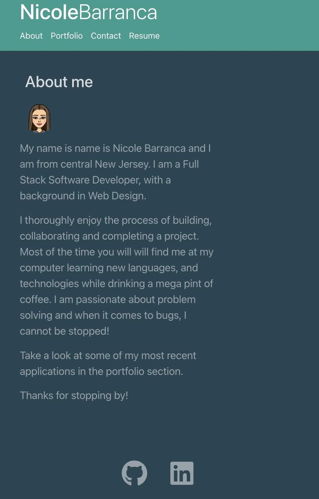

  

<h1 align="center">NB Portfolio</h1>

## Description

This appilcation is a portfolio for Nicole Barranca Built with React.js.

## Built With

- React.js
- Bootstrap
- React Router

## Website

Take a look at [NB Portfolio](https://nicolebarranca.github.io/).

</a>

## Contribution

Made with ❤️ by Nicole Barranca

## Questions

Feel free to contact me directly at nikkibarranca@gmail.com if you have any questions about the repo.

You can find more of my work at [Nicole Barranca](https://github.com/NicoleBarranca).
